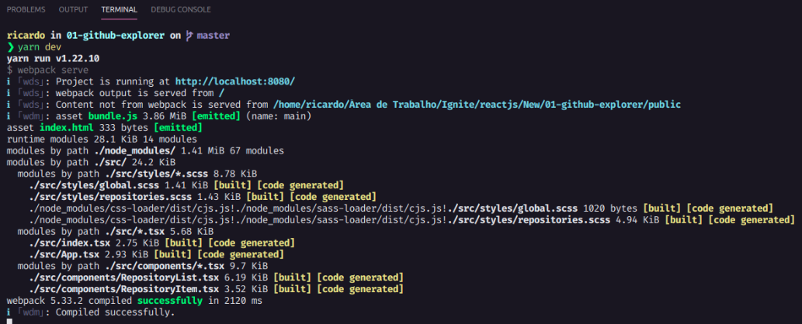

[](https://home.devtrails.com.br/)

<h3 align="center">
<br>
🚧 Ignite - Trilha ReactJS 1.0 🚀 em construção... 🚧
<br>
<br>

<p align="center">
  
  
  

  

  

  

</p>
</h3>
<br>

# Github Explorer

<br>
<br>

## 💻 **Sobre o projeto**

<br>

Este é um aplicativo desenvolvido durante o curso Ignite Trilha ReactJS ministrado por Diego Fernandes, CTO da Rocketseat.

Nele, é abordado conceitos importantes quanto a estrutura dos projetos e boas práticas na programação, lidando com as configurações iníciais de projetos, e consumindo a API do Github.

De partida, o código foi escrito em javascript, posteriormente foi realizada a migração do código para o TypeScript.

Ao final do módulo, foram feitas algumas alterações pessoais no layout, assim como a integração da funcionalidade para remoção de um repositório da lista.

Buscando aprimorar ainda mais os conhecimentos, novas funcionalidades serão integradas a este aplicativo, e o mesmo será hospedado na Netlify.
<br>
<br>

---

<br>

## 📖 **Tabela de conteúdos**

- [Sobre o projeto](#-sobre-o-projeto)
- [Tabela de Conteúdo](#-tabela-de-conteúdos)
- [Funcionalidades](#-funcionalidades)
- [Layout](#-layout)
- [Tecnologias](#-tecnologias)
- [Pré-requisitos](#-pré-requisitos)
- [Autor](#-autor)
- [Licença MIT](#-licença-mit)

<br>

---

<br>

## 🔩 **Funcionalidades**

<br>

- [x] Carregar lista de repositórios
- [x] Acessar repositório
- [x] Remover repositório
- [ ] Fazer busca de repositório no github
- [ ] Adicionar repositório na lista
- [ ] Favoritar repositório
- [ ] Cadastrar usuário
- [ ] Login/Logout
- [ ] Recuperar senha
- [ ] Salvar dados da lista
- [ ] Campo para comentários no repositório
- [ ] Gerenciar perfil do usuário

<br>

---

## 🎨 **Layout**

<br>

### **Web**

<br>
<br>

<p align="center">
  
  
  <br>
  Layout original da aplicação
</p>
<br>
<br>

Buscando enriquecer o aprendizado, desenvolvi algumas alterações tanto de layout quanto de funcionalidades. Abaixo o layout alterado.
<br>
<br>

<p align="center">
  
  
  <br>
  Layout da aplicação com as alterações realizadas
</p>
<br>

O layout atual possui responsividade na versão web. Nas próximas versões serão trabalhados os layouts para dispositivos mobile, assim como a funcionalidade para busca de repositórios no github, botão para inclusão do repositório encontrado, um botão para favoritar os repositórios, além de inclusão de mais campos de informações sobre cada repositório.

<br>

---

<br>
<br>

## 🛠 Tecnologias

<br>

Foram utilizadas as seguintes ferramentes no desenvolvimento do projeto:

- [TypeScript](https://www.typescriptlang.org/pt/)
- [React](https://pt-br.reactjs.org/)
- [Node.js](https://nodejs.org/pt-br/)
- [Sass](https://sass-lang.com/)
- [Babel](https://babeljs.io/)
- [Webpack](https://webpack.js.org/)
- [Yarn](https://yarnpkg.com/)
- [Prettier](https://prettier.io/)
- [EsLint](https://eslint.org/)
  <br>
  <br>

---

<br>

## 🖥 Pré-requisitos

<br>

Antes de começar, você vai precisar ter instalado em sua máquina as seguintes ferramentas [Git](https://git-scm.com), [Node.js](https://nodejs.org/en/).

Além disto é bom ter um editor para trabalhar com o código como [VSCode](https://code.visualstudio.com/).
<br>
<br>

### 💽 Copiando o repositório

<br>

Com o Github instalado no seu computador, abra o terminal acesse a pasta onde deseja baixar o repositório e execute o comando abaixo.

```bash
# Clone este repositório
$ git clone git@github.com:rgranvilla/01-github-explorer.git

# Acesse a pasta do projeto no terminal/cmd
$ cd 01-github-explorer


# Instale as dependências
$ yarn

# Execute a aplicação em modo de desenvolvimento
$ yarn dev

# O servidor inciará na porta:8080 - acesse <http://localhost:8080>
```

Você deve receber uma mensagem informando o sucesso da compilação.



<br>
<br>

<h2 align="center">

🎉 Parabéns! 🎉

</h1>

<p align="center">


</P>
<br>

Se você chegou até aqui, estará com o aplicativo rodando em sua máquina. Sinta-se a vontade para modificar, melhorar e sugerir modificações na aplicação.
Se você gostou do repositório marque o **Star** 🌟.

<br>

---

<br>
<br>

## 🤓 Autor

<br>

[](https://github.com/rgranvilla)

<a href="https://github.com/rgranvilla">Ricardo Granvilla 🚀</a>

Desenvolvido com muito carinho 😉 para você 👋 Entre em contato!
<br>

[](https://twitter.com/rgranvilla) [](https://www.linkedin.com/in/rgranvilla/) [](mailto:rgranvilla@gmail.com)

<br>
<br>

# Licença MIT

<br>

Copyright (c) 2021 Ricardo Granvilla

A permissão é concedida, gratuitamente, a qualquer pessoa que obtenha uma cópia deste software e arquivos de documentação associados (o "Software"), para lidar com o Software sem restrição, incluindo, sem limitação, os direitos de usar, copiar, modificar, mesclar , publicar, distribuir, sublicenciar e / ou vender cópias do Software e permitir que as pessoas a quem o Software é fornecido o façam, sujeito às seguintes condições:

O aviso de direitos autorais acima e este aviso de permissão devem ser incluídos em todas as cópias ou partes substanciais do Software.

O SOFTWARE É FORNECIDO "NO ESTADO EM QUE SE ENCONTRA", SEM QUALQUER TIPO DE GARANTIA, EXPRESSA OU IMPLÍCITA, INCLUINDO, MAS NÃO SE LIMITANDO ÀS GARANTIAS DE COMERCIALIZAÇÃO, ADEQUAÇÃO A UM DETERMINADO FIM E NÃO VIOLAÇÃO. EM NENHUMA HIPÓTESE OS AUTORES OU TITULARES DOS DIREITOS AUTORAIS SERÃO RESPONSÁVEIS POR QUALQUER RECLAMAÇÃO, DANOS OU OUTRA RESPONSABILIDADE, SEJA EM UMA AÇÃO DE CONTRATO, DELITO OU DE OUTRA FORMA, DECORRENTE DE, FORA DE OU EM CONEXÃO COM O SOFTWARE OU O USO OU OUTRAS NEGOCIAÇÕES NO PROGRAMAS.
