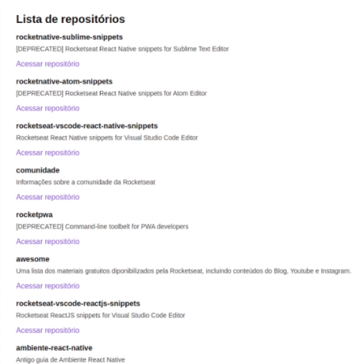
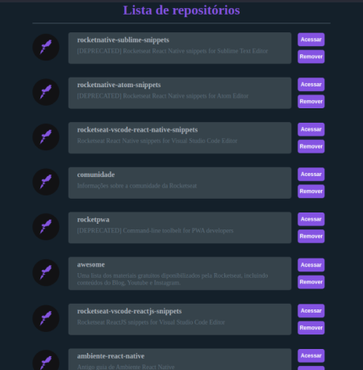

<h3 align="center">
 
🚧 Ignite - Trilha ReactJS 1.0 🚀 em construção... 🚧
 
 

  
  
  

  

  

  

</h3>
 

# Github Explorer

 
 

## 💻 **Sobre o projeto**

 

Este é um aplicativo desenvolvido durante o curso Ignite Trilha ReactJS ministrado por Diego Fernandes, CTO da Rocketseat.

Nele, é abordado conceitos importantes quanto a estrutura dos projetos e boas práticas na programação, lidando com as configurações iníciais de projetos, e consumindo a API do Github.

De partida, o código foi escrito em javascript, posteriormente foi realizada por etapas a migração do código para o TypeScript.

Ao final do módulo, algumas alterações no layout foram realizadas e a integração da funcionalidade para remoção de um repositório da lista.

Buscando aprimorar ainda mais os conhecimentos, novas funcionalidades serão integradas a este aplicativo, e o mesmo será hospedado na Netlify.
 
 

---

 

## 📖 **Tabela de conteúdos**

- [Sobre o projeto](#-sobre-o-projeto)
- [Tabela de Conteúdo](#-tabela-de-conteúdos)
- [Funcionalidades](#-funcionalidades)
- [Layout](#-layout)
- [Tecnologias](#-tecnologias)
- [Demonstração]
- [Pré-requisitos]
- [Autor](#-autor)
- [Licença]

 

---

 

## 🔩 **Funcionalidades**

 

- [x] Carregar lista de repositórios
- [x] Acessar repositório
- [x] Remover repositório
- [ ] Fazer busca de repositório no github
- [ ] Adicionar repositório na lista
- [ ] Favoritar repositório
- [ ] Cadastrar usuário
- [ ] Login/Logout
- [ ] Recuperar senha
- [ ] Salvar dados da lista
- [ ] Campo para comentários no repositório
- [ ] Gerenciar perfil do usuário

 

---

## 🎨 **Layout**

 

### **Web**

 
 

  
  
   
  Layout original da aplicação

 
 

Buscando enriquecer o aprendizado, desenvolvi algumas alterações tanto de layout quanto de funcionalidades. Abaixo o layout alterado.
 
 

  
  
   
  Layout da aplicação com as alterações realizadas

 

O layout atual possui responsividade na versão web. Nas próximas versões serão trabalhados os layouts para dispositivos mobile, assim como a funcionalidade para busca de repositórios no github, botão para inclusão do repositório encontrado, um botão para favoritar os repositórios, além de inclusão de mais campos de informações sobre cada repositório.

 

---

 
 

## 🛠 Tecnologias

 

Foram utilizadas as seguintes ferramentes no desenvolvimento do projeto:

- [TypeScript](https://www.typescriptlang.org/pt/)
- [React](https://pt-br.reactjs.org/)
- [Node.js](https://nodejs.org/pt-br/)
- [Sass](https://sass-lang.com/)
- [Babel](https://babeljs.io/)
- [Webpack](https://webpack.js.org/)
- [Yarn](https://yarnpkg.com/)
- [Prettier](https://prettier.io/)
- [EsLint](https://eslint.org/)
   
   

---

 
 

## 🤓 Autor

 

 

<a href="https://github.com/rgranvilla">Ricardo Granvilla 🚀</a>

Desenvolvido com muito carinho 😉 para você 👋 Entre em contato!
 

  
